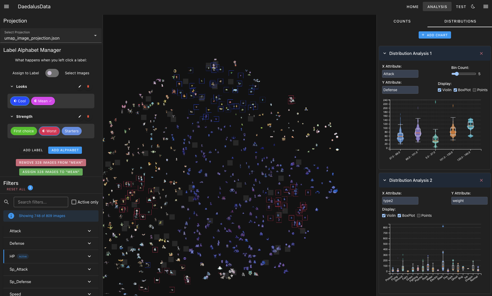
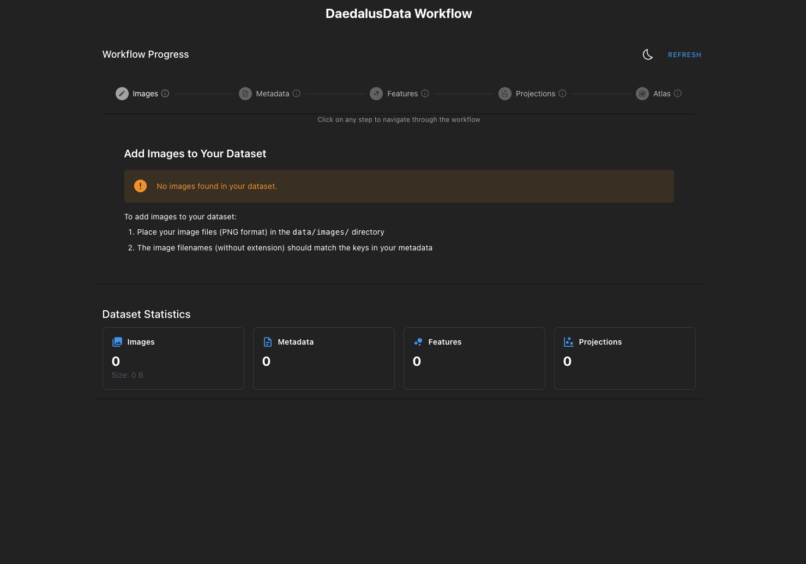

# DaedalusData

DaedalusData is an open-source platform for the exploration, visualization, and labeling of scientific image collections. It provides researchers and data scientists with a flexible and accessible environment for analyzing, exploring, and extracting knowledge from image datasets.

**Designed for researchers by researchers**: DaedalusData prioritizes ease of use and minimal setup requirements. You can be up and running in minutes with just Docker installed, no machine learning or web development expertise required. You can run the full application locally with all data fully in your control.

[](https://www.gnu.org/licenses/gpl-3.0)



<br>



## Features

- **Image Exploration**: Browse and interact with image collections in a web-based interface
- **Dimensionality Reduction**: Visualize high-dimensional data in intuitive 2D projections using Three.js
- **Metadata Exploration**: Analyze and filter images based on metadata attributes using bar charts and violin plots
- **Labeling System**: Create and maintain multiple label alphabets for image classification
- **Jupyter Integration**: Perform feature extraction and analysis with template notebooks
- **Fully Dockerized**: Simple setup and deployment with Docker Compose
- **Extensible Architecture**: Mount directories for easy data interchange with other tools

## Architecture

DaedalusData combines a Nuxt.js frontend with Jupyter notebooks for analysis and feature extraction. The entire application is containerized with Docker, providing a consistent environment across different systems.

```
DaedalusData/
├── frontend/         # Nuxt.js frontend application
├── notebooks/        # Jupyter notebooks for analysis
├── data/             # Data files (mounted volume)
│   ├── images/       # PNG image files
│   ├── metadata/     # JSON metadata
│   ├── features/     # Extracted features (CSV/NPZ)
│   ├── projections/  # Dimensionality reduction results
│   └── labels/       # Label alphabets and assignments
```

## Getting Started

DaedalusData is designed to be extremely easy to set up and use. The only prerequisites are:

1. **Docker** - [Installation Guide](https://docs.docker.com/get-docker/)
2. **Docker Compose** - [Installation Guide](https://docs.docker.com/compose/install/)

That's it! Everything else runs inside Docker, so you don't need to worry about dependencies, Python versions, or library conflicts.

### Quick Start

1. Clone the repository:
   ```bash
   git clone git@github.com:alexv710/daedalusData.git
   cd daedalusdata
   ```

2. Start the application:
   ```bash
   docker compose up -d
   ```

3. Access the application:
   - Frontend: [http://localhost:3000](http://localhost:3000)
   - Jupyter: [http://localhost:8888](http://localhost:8888) (token: `daedalus-dev`)

4. Run the included example notebooks:
   - Open Jupyter in your browser
   - Navigate to the example notebooks
   - Run the notebooks in sequence to process the sample dataset

That's it! You now have a fully functional image exploration and labeling system.

### Configuration

The application is configured through the `compose.yaml` file. Key configuration options:

- `JUPYTER_TOKEN`: Authentication token for Jupyter (default: `daedalus-dev`)
- Volume mounts for data directories

## Data Organization

DaedalusData operates on the following data structures:

### Images

Place your PNG image files in the `data/images/` directory. The image filenames (without extension) must match the keys in your metadata JSON file.

Example structure:
```
data/images/
├── image1.png
├── image2.png
└── image3.png
```

### Metadata

Create a JSON file in the `data/metadata/` directory with image metadata. The structure should be a flat JSON object where keys are image names (without file extension) and values are objects containing atomic attributes.

Example `images.json`:
```json
{
  "image1": {
    "type": "sample",
    "size": 10.5,
    "category": "A"
  },
  "image2": {
    "type": "control",
    "size": 8.3,
    "category": "B"
  }
}
```

### Features

Features can be stored in two formats (You can store them however you like, but the sample dimred notebook would expect these formats):

1. **CSV format**:
   ```
   ,0,1,2,3
   image1,0.002,0.016,0.885,
   image2,0.055,0.844,,
   ```

2. **NPZ format**:
   ```python
   np.savez_compressed(
       "features.npz", 
       image_names=image_names,
       features=img_features_array
   )
   ```

The Jupyter notebooks provide templates for feature extraction.

### Projections

Projections are stored as JSON files in the `data/projections/` directory. A manifest file (`projection_manifest.json`) lists all available projections.

Example `projection_manifest.json`:
```json
[
  "umap_image_projection.json",
  "umap_combined_projection.json"
]
```

Example projection file:
```json
[
  {
    "image": "image1",
    "UMAP1": 1.3517,
    "UMAP2": -1.3488
  },
  {
    "image": "image2",
    "UMAP1": -1.4149,
    "UMAP2": 1.5770
  }
]
```

### Labels

Labels are organized into "alphabets" - sets of label categories. Each alphabet is stored as a JSON file with a unique ID.

Example label alphabet:
```json
{
  "id": "54f54ea2-a39b-4405-9e4c-9c5bd1456ea5",
  "name": "Category",
  "description": "Main image categories",
  "labels": [
    {
      "id": "843c0f3f-4403-4f30-babf-9f5863da86aa",
      "value": "Type A",
      "description": "Category A images",
      "color": "#17c200",
      "images": ["image1", "image3"]
    },
    {
      "id": "d43e75c8-91e7-4c2b-9302-feea559dc38b",
      "value": "Type B",
      "description": "Category B images",
      "color": "#de1753",
      "images": ["image2"]
    }
  ]
}
```

A manifest file (`label_manifest.json`) keeps track of all label alphabets:
```json
{
  "alphabets": [
    "alphabet_a52854a0-0a66-41b2-98e8-74d7da996caa.json",
    "alphabet_54f54ea2-a39b-4405-9e4c-9c5bd1456ea5.json"
  ]
}
```

## Usage Guide

### Workflow Overview

1. **Data Preparation**:
   - Place your images in `data/images/`
   - Create metadata in `data/metadata/images.json`

2. **Feature Extraction**:
   - Use the Jupyter notebooks to extract features from images
   - Save features to `data/features/`

3. **Dimensionality Reduction**:
   - Generate projections using the notebook templates
   - Save projections to `data/projections/`

4. **Exploration & Labeling**:
   - Use the frontend to explore your data
   - Create label alphabets and assign labels to images
   - Filter and analyze based on metadata attributes
   - Labeling in the frontend will update the label jsons in `data/labels/`

### Jupyter Notebooks

The application provides template notebooks for:

1. **Data Loading**: Load and preprocess image data
2. **Feature Extraction**: Extract features from images using pre-trained models
3. **Dimensionality Reduction**: Project features to 2D space for visualization

The included notebooks implement standard, widely-used methods that work well out of the box:

#### Feature Extraction

The default feature extraction uses ResNet50, a pre-trained deep learning model:

```python
from tensorflow.keras.applications import ResNet50
from tensorflow.keras.applications.resnet50 import preprocess_input

# Pre-trained model for feature extraction
model = ResNet50(weights='imagenet', include_top=False, pooling='avg')

# Extract features from images
features = model.predict(preprocessed_images)
```

This approach provides robust image embeddings without requiring any machine learning expertise.

#### Dimensionality Reduction

The standard dimensionality reduction uses UMAP to create 2D projections:

```python
def compute_normalized_umap(features, n_neighbors=15, min_dist=0.1, 
                           n_components=2, random_state=42):
    reducer = umap.UMAP(n_neighbors=n_neighbors, min_dist=min_dist, 
                       n_components=n_components, random_state=random_state)
    embedding = reducer.fit_transform(features)
    # Normalize coordinates such that the mean is 0 (centered)
    embedding_centered = embedding - np.mean(embedding, axis=0)
    return embedding_centered
```

The notebooks generate two standard projections:
- Image-only projection based on visual features
- Combined projection integrating image features and metadata

Access Jupyter at [http://localhost:8888](http://localhost:8888) with token `daedalus-dev`.

### Frontend Interface

The web interface provides tools for:

- Visualizing image collections in 2D/3D projections
- Filtering and selecting images based on metadata
- Creating and managing label alphabets
- Visualizing metadata distributions with bar charts and violin plots
- Exporting labeled datasets

Access the frontend at [http://localhost:3000](http://localhost:3000).

## Extending DaedalusData

### Adding Custom Feature Extractors

1. Create a new notebook in the `notebooks/` directory
2. Use the template notebooks as a guide
3. Save extracted features to `data/features/`

### Creating Custom Projections

1. Use the dimensionality reduction notebook as a template
2. Experiment with different algorithms (UMAP, t-SNE, PCA, etc.)
3. Save projections in the format described above
4. Update the projection manifest

## Contributing

Contributions are welcome! Please feel free to reach out if you have a specific use case or submit a Pull Request.

## License

This project is licensed under the GNU General Public License v3.0 - see the LICENSE file for details.

## Citation

If you use DaedalusData in your research, please cite:

```
@article{wyss2023daedalusdata,
  title={DaedalusData: A Dockerized Open-Source Platform for Exploration, Visualization, and Interactive Labeling of Image Collections},
  author={Wyss, Alexander},
  journal={tbd},
  year={tbd}
}
```

## Acknowledgments

This open-source implementation builds upon research originally published in IEEE Transactions on Visualization and Computer Graphics:

> A. Wyss, G. Morgenshtern, A. Hirsch-Hüsler and J. Bernard, "[DaedalusData: Exploration, Knowledge Externalization and Labeling of Particles in Medical Manufacturing — A Design Study](https://ieeexplore.ieee.org/document/10689477)" in IEEE Transactions on Visualization and Computer Graphics, vol. 31, no. 1, pp. 54-64, Jan. 2025, doi: 10.1109/TVCG.2024.3456329.

**Research Keywords**: Visual Analytics, Image Data, Knowledge Externalization, Data Labeling, Anomaly Detection, Medical Manufacturing

The original design study addressed challenges in medical diagnostics, specifically focusing on particle-based contamination in in-vitro diagnostics consumables. This dockerized implementation makes the DaedalusData approach accessible to researchers in various domains beyond medical manufacturing.

For more information about the design study methodology, evaluation results, and theoretical framework for knowledge externalization, please refer to the original publication.